# Manual Técnico — Proyecto Autómatas y Lenguajes Formales

> Documento técnico para revisores y futuros mantenedores. Cubre la
> arquitectura, los patrones de diseño usados, los algoritmos clave y
> los formatos internos.
>
> Universidad Mariano Gálvez · Facultad de Ingeniería · Sección A · 2026.
>
> Para el uso paso a paso de la aplicación, ver **[`MANUAL_USUARIO.md`](MANUAL_USUARIO.md)**.

| | |
|---|---|
| **Versión** | 1.0 (Fase 8 — entrega final) |
| **Stack** | Java 17 · Swing · OpenPDF 1.3.43 · JUnit 5.10 · Graphviz 14.1.4 |
| **Paradigmas** | OOP · MVC · Singleton · Strategy · Factory · Encapsulamiento · Inmutabilidad |
| **Tests** | 203/203 verde |

---

## 📑 Tabla de contenidos

1. [Conceptos teóricos](#1-conceptos-teóricos)
2. [Arquitectura general](#2-arquitectura-general)
3. [Diagrama de clases](#3-diagrama-de-clases)
4. [Patrones de diseño](#4-patrones-de-diseño)
6. [Algoritmos clave](#5-algoritmos-clave)
   - 5.1 [Evaluación de un AFD](#51-evaluación-de-un-afd)
   - 5.2 [Evaluación de una gramática](#52-evaluación-de-una-gramática)
   - 5.3 [Conversión AFD → Gramática](#53-conversión-afd--gramática)
   - 5.4 [Conversión Gramática → AFD](#54-conversión-gramática--afd)
   - 5.5 [Generación de DOT / PDF](#55-generación-de-dot--pdf)
7. [Formatos de archivo](#6-formatos-de-archivo)
8. [Stack y dependencias](#7-stack-y-dependencias)
9. [Cómo compilar, ejecutar y testear](#8-cómo-compilar-ejecutar-y-testear)
10. [Decisiones de diseño y limitaciones](#9-decisiones-de-diseño-y-limitaciones)

---

## 1. Conceptos teóricos

### Autómata Finito Determinista (AFD)

Un **AFD** es una quíntupla `M = (Σ, Q, δ, q₀, F)`:

- `Σ` — alfabeto finito de entrada.
- `Q` — conjunto finito de estados.
- `δ : Q × Σ → Q` — función de transición (total o parcial; un AFD es determinista si para todo `(q, a)` hay **a lo sumo una** transición).
- `q₀ ∈ Q` — estado inicial.
- `F ⊆ Q` — estados de aceptación.

Una cadena `w ∈ Σ*` es **aceptada** si al procesar `w` desde `q₀` se llega a un estado en `F`.

### Gramática Regular

Una **gramática** regular es una cuádrupla `G = (N, T, P, S)`:

- `N` — no terminales (símbolos que pueden reescribirse).
- `T` — terminales (símbolos que aparecen en las cadenas).
- `P` — conjunto de producciones `α ∈ (γ → δ)`.
- `S ∈ N` — símbolo inicial.

En este curso trabajamos con **gramáticas lineales por la derecha** (cada producción es ε, o solo-terminales, o terminales seguidas de exactamente un NT al final). Una gramática regular genera el mismo lenguaje que un AFD (Hopcroft-Ullman).

---

## 2. Arquitectura general

La aplicación sigue **MVC** con una capa de **servicios** (controladores) entre el modelo y la vista:

```
+----------------------+
|        VISTA         |   ← Swing (JFrame + CardLayout + JOptionPane)
|  vista.*             |
+----------+-----------+
           | Navegador (interfaz)
           ▼
+----------------------+
|      SERVICIO        |   ← Controladores / lógica de negocio
|  servicio.*          |     Conversores, evaluadores, repositorio
+----------+-----------+
           |
           ▼
+----------------------+
|       MODELO         |   ← Estado + validaciones
|  modelo.*            |     AFD, Gramatica, Produccion
+----------+-----------+
           ▲
+----------------------+
|     VALIDACIÓN       |   ← Excepciones y normalización
|  validacion.*        |
+----------------------+

Otros paquetes:
  * archivo/   ← I/O (.afd, .gtk) con Factory
  * reporte/  ← Generadores Dot/Graphviz/PDF con OpenPDF
  * tools/    ← Utilidades de mantenimiento (CapturadorPantallas)
```

### Paquetes

| Paquete | Contenido |
|---------|-----------|
| `automatas.modelo` | `AFD`, `Gramatica`, `Produccion` — clases de dominio con validaciones. |
| `automatas.servicio` | `RepositorioAutomatas`, `Evaluador*`, `Conversor*`, `GeneradorCadenas`, `HistorialEvaluaciones`, `RegistroEvaluacion`. |
| `automatas.archivo` | `Lector*`, `Escritor*` (interfaz + impl), `ArchivoFactory`. |
| `automatas.vista` | `VentanaPrincipal`, `Navegador`, `DatosCurso`, `BotonAyuda`, `Panel*` (8 paneles). |
| `automatas.reporte` | `GeneradorDot`, `GeneradorGraphviz`, `GeneradorPDF`, `ExcepcionReporte`. |
| `automatas.validacion` | `ValidacionException`, `ValidacionUtils`. |
| `automatas.tools` | `CapturadorPantallas` (utilidad de mantenimiento, no parte del producto). |
| `automatas` | `Main` (punto de entrada, con `--demo` o GUI). |

---

## 3. Diagrama de clases

```mermaid
classDiagram
    class AFD {
        -nombre: String
        -estados: Set
        -alfabeto: Set
        -estadosAceptacion: Set
        -transiciones: Map
        -estadoInicial: String
        +agregarEstado(String)
        +agregarSimbolo(String)
        +agregarTransicion(String, String, String)
        +setEstadoInicial(String)
        +agregarEstadoAceptacion(String)
        +setAceptacion(String, boolean)
        +mover(String, String) String
        +esAceptacion(String) boolean
        +getNombre() String
        +getEstados() Set
        +getAlfabeto() Set
        +getEstadosAceptacion() Set
        +getEstadoInicial() String
        +getTransiciones() Map
    }

    class Gramatica {
        -nombre: String
        -noTerminales: Set
        -terminales: Set
        -producciones: Map
        -inicial: String
        +agregarNoTerminal(String)
        +agregarTerminal(String)
        +setInicial(String)
        +agregarProduccion(String)
        +getProduccionesDe(String) List
        +getNombre() String
        +getNoTerminales() Set
        +getTerminales() Set
        +getInicial() String
        +getProducciones() Map
    }

    class Produccion {
        -izquierdo: String
        -derecho: List
        +esEpsilon() boolean
        +getIzquierdo() String
        +getDerecho() List
        +equals(Object) boolean
        +hashCode() int
        +toString() String
    }

    class Evaluador {
        <<interface>>
        +evaluar(String) ResultadoEvaluacion
    }

    class EvaluadorAFD {
        -afd: AFD
        +getAfd() AFD
        +evaluar(String) ResultadoEvaluacion
    }

    class EvaluadorGramatica {
        -MAX_PROFUNDIDAD = 100
        -gramatica: Gramatica
        +getGramatica() Gramatica
        +evaluar(String) ResultadoEvaluacion
    }

    class ConversorAFDGramatica {
        -afd: AFD
        +convertir(String) Gramatica
    }

    class ConversorGramaticaAFD {
        +NOMBRE_ESTADO_FINAL = "F"
        -gramatica: Gramatica
        +convertir(String) AFD
    }

    class RepositorioAutomatas {
        <<Singleton>>
        -INSTANCIA: RepositorioAutomatas
        -afds: Map
        -gramaticas: Map
        +getInstancia() Repositorio$
        +registrar(AFD)$
        +registrar(Gramatica)$
        +obtenerAFD(String) AFD
        +obtenerGramatica(String) Gramatica
        +existe(String) boolean
        +getNombres() Set
        +limpiar()
    }

    class HistorialEvaluaciones {
        <<Singleton>>
        -INSTANCIA: HistorialEvaluaciones
        -registros: List
        +getInstancia() Historial$
        +registrar(String, String, boolean)$
        +getTodos() List
        +limpiar()
    }

    class Lector~T~ {
        <<interface>>
        +leer(Path) T
    }

    class Escritor~T~ {
        <<interface>>
        +escribir(T, Path) void
    }

    class ArchivoFactory {
        <<utility>>
        +crearLector(Path)$ Lector
        +crearEscritor(Path)$ Escritor
    }

    class LectorAFD {
        +leer(Path) AFD
    }

    class LectorGTK {
        +leer(Path) Gramatica
    }

    class EscritorAFD {
        +escribir(AFD, Path)
    }

    class EscritorGTK {
        +escribir(Gramatica, Path)
    }

    class GeneradorDot {
        <<utility>>
        +generar(AFD)$ String
    }

    class GeneradorGraphviz {
        <<utility>>
        +PROPIEDAD_PATH = "automatas.graphviz.path"
        +EJECUTABLE_POR_DEFECTO = "dot"
        +renderizar(String)$ byte[]
        +renderizar(String, Path)$
    }

    class GeneradorPDF {
        <<utility>>
        +generar(AFD, Path)$
        +generar(Gramatica, Path)$
    }

    class VentanaPrincipal {
        -cartas: CardLayout
        +PORTADA, MENU, CREAR_AFD, ...
        +irA(String)$
        +mostrarInfo(String, String)$
        +mostrarError(String, String)$
        +confirmar(String, String) boolean
    }

    class Navegador {
        <<interface>>
        +irA(String)$
        +mostrarInfo(String, String)$
        +mostrarError(String, String)$
        +confirmar(String, String) boolean
    }

    class Main {
        +main(String[]) main
    }

    Evaluador <|.. EvaluadorAFD
    Evaluador <|.. EvaluadorGramatica
    EvaluadorAFD --> AFD
    EvaluadorGramatica --> Gramatica
    Gramatica --> Produccion
    ConversorAFDGramatica --> AFD
    ConversorAFDGramatica ..> Gramatica : creates
    ConversorGramaticaAFD --> Gramatica
    ConversorGramaticaAFD ..> AFD : creates
    RepositorioAutomatas --> AFD : stores
    RepositorioAutomatas --> Gramatica : stores
    HistorialEvaluaciones --> RegistroEvaluacion : records
    Lector <|.. LectorAFD
    Lector <|.. LectorGTK
    Escritor <|.. EscritorAFD
    Escritor <|.. EscritorGTK
    ArchivoFactory ..> LectorAFD : creates
    ArchivoFactory ..> LectorGTK : creates
    ArchivoFactory ..> EscritorAFD : creates
    ArchivoFactory ..> EscritorGTK : creates
    GeneradorPDF --> GeneradorDot
    GeneradorPDF --> GeneradorGraphviz
    GeneradorPDF --> GeneradorCadenas
    GeneradorPDF --> HistorialEvaluaciones
    VentanaPrincipal ..|> Navegador
    VentanaPrincipal --> PanelPortada
    VentanaPrincipal --> PanelMenu
    VentanaPrincipal --> PanelCrearAFD
    VentanaPrincipal --> PanelCrearGramatica
    VentanaPrincipal --> PanelEvaluar
    VentanaPrincipal --> PanelCargar
    VentanaPrincipal --> PanelGuardar
    VentanaPrincipal --> PanelReportes
    Main --> VentanaPrincipal : launches
```



---

## 4. Patrones de diseño

### 4.1 Singleton

**Clases:** `RepositorioAutomatas`, `HistorialEvaluaciones`.

```java
public class RepositorioAutomatas {
    private static final RepositorioAutomatas INSTANCIA = new RepositorioAutomatas();
    private RepositorioAutomatas() {}
    public static RepositorioAutomatas getInstancia() { return INSTANCIA; }
}
```

- Un único repositorio para ambos tipos (AFD y gramática comparten espacio de nombres).
- `HistorialEvaluaciones` es además **thread-safe** (`synchronized` en cada método).

### 4.2 Strategy

**Interfaces:** `Evaluador`, `Lector<T>`, `Escritor<T>`.

```java
public interface Evaluador {
    ResultadoEvaluacion evaluar(String cadena);
}
```

- `EvaluadorAFD` y `EvaluadorGramatica` implementan la misma interfaz; la UI no sabe cuál usar hasta consultar el tipo en el repositorio.
- `Lector` y `Escritor` parametrizados por tipo; las implementaciones concretas son `LectorAFD`/`LectorGTK`/`EscritorAFD`/`EscritorGTK`.

### 4.3 Factory

**Clase:** `ArchivoFactory`.

```java
public static Lector<?> crearLector(Path archivo) {
    String nombre = archivo.getFileName().toString().toLowerCase();
    if (nombre.endsWith(".afd")) return new LectorAFD();
    if (nombre.endsWith(".gtk")) return new LectorGTK();
    throw new ValidacionException("Extensión no reconocida");
}
```

- Dispatch por extensión; devuelve `Lector<?>` para forzar cast explícito al modelo concreto.

### 4.4 MVC

- **Modelo:** `modelo.AFD`, `modelo.Gramatica` con atributos `private final` y validaciones en setters.
- **Vista:** `vista.VentanaPrincipal` + `vista.Panel*`. La vista conoce los servicios vía la interfaz `Navegador`.
- **Servicio (controlador):** `servicio.Evaluador*`, `servicio.Conversor*`, `servicio.GeneradorCadenas`, etc.

### 4.5 Encapsulamiento + inmutabilidad

- Todos los atributos del modelo son `private final`.
- Las colecciones expuestas son inmutables: `Collections.unmodifiableXxx(...)` y copia profunda en `getTransiciones()` / `getProducciones()`.
- Una vez construido, un modelo no se puede mutar desde fuera.

---

## 5. Algoritmos clave

### 5.1 Evaluación de un AFD

```
ENTRADA: cadena w, AFD M = (Σ, Q, δ, q₀, F)
SALIDA:  ResultadoEvaluacion (valida, ruta)
```

```
1. actual ← q₀
2. pasos ← []
3. para cada símbolo a ∈ w:
     a. siguiente ← δ(actual, a)
     b. si siguiente = null:
          agregar "actual, ?, a" a pasos
          devolver ResultadoEvaluacion(false, ruta)
     c. agregar "actual, siguiente, a" a pasos
     d. actual ← siguiente
4. si actual ∈ F:
     devolver ResultadoEvaluacion(true, ruta)
   si no:
     devolver ResultadoEvaluacion(false, ruta)
```

**Formato de la ruta:**
```
Ruta en AFD: A, A, a; A, C, b; C, D, b
```

`origen, destino, símbolo` separados por `; `. Si el AFD se bloquea, el destino es `?`.

**Complejidad:** O(|w|) — un solo paso por símbolo.

### 5.2 Evaluación de una gramática

```
ENTRADA: cadena w, gramática derecha-lineal G = (N, T, P, S)
SALIDA:  ResultadoEvaluacion (valida, expansion)
```

Algoritmo: **backtracking forward** con poda.

```
función backtrack(form, pasos, w, visitados, prof):
    si prof > MAX_PROFUNDIDAD: devolver false
    si form = w:
        si w ≠ "" y form no es el último paso:
            agregar w a pasos
        devolver true
    posNT ← índice del último NT en form
    si posNT = -1: devolver false  # no hay nada que expandir
    prefijo ← form[0..posNT)
    si prefijo.length > w.length: devolver false
    si w no empieza con prefijo: devolver false
    clave ← form[posNT] + "|" + prefijo
    si clave ∈ visitados: devolver false
    visitados.agregar(clave)
    para cada producción p del NT en form[posNT]:
        rhs ← si p es ε entonces "" sino join(p.getDerecho)
        nuevo ← form con form[posNT] reemplazado por rhs
        pasoLog ← si p es ε entonces nuevo + "(epsilon)" sino nuevo
        pasos.agregar(pasoLog)
        si backtrack(nuevo, pasos, w, visitados, prof+1): devolver true
        pasos.eliminarÚltimo()
    devolver false
```

**Poda clave:** la tupla `(NT, prefijo_del_form)` evita re-explorar la misma situación y termina la recursión para gramáticas con ciclos (`A → ε A`, etc.).

**Formato de la expansión:**
```
Expansión Gramática: A>0B>00B>001A>0011A>0011(epsilon)>0011
```

Cada paso lleva el *form* resultante; el sufijo `(epsilon)` marca ε-producciones.

**Complejidad:** O(|w| × |N| × |P|) en el peor caso, pero la poda por estado lo mantiene en la práctica subexponencial.

### 5.3 Conversión AFD → Gramática

```
ENTRADA: AFD M = (Σ, Q, δ, q₀, F)
SALIDA:  Gramática G = (N, T, P, S) con:
         N = Q
         T = Σ
         S = q₀
         P = {q > a δ(q,a)  |  para cada transición δ(q,a) = q'}
           ∪ {q > epsilon   |  para cada q ∈ F}
```

**Implementación** (`ConversorAFDGramatica`): itera las transiciones y los estados de aceptación del AFD; por cada transición `δ(A,a)=B` agrega la producción `A > a B`, y por cada estado de aceptación `F` agrega `F > epsilon`.

**Garantías:** la gramática resultante es lineal por la derecha. La equivalencia de lenguajes se verifica con `EquivalenciaConversionTest` sobre muestreo exhaustivo de cadenas de longitud ≤ 4.

### 5.4 Conversión Gramática → AFD

```
ENTRADA: Gramática G = (N, T, P, S) (lineal por la derecha)
SALIDA:  AFD M = (Σ, Q, δ, q₀, F) tal que L(M) = L(G)
```

```
Q ← N; Σ ← T; q₀ ← S
necesitaF ← ∃ producción de la forma "A > w" (sin NT)
if necesitaF:
    F ← nombre_libre(NOMBRE_ESTADO_FINAL, N)  # "F", "F#0", "F#1"...
    Q ← Q ∪ {F}
    estadosAceptacion ← {F}
para cada (A > rhs) ∈ P:
    si rhs = ε:             aceptar(A)
    si rhs = t (1 terminal): δ(A, t) = F
    si rhs = t B:           δ(A, t) = B
    otros casos:            ValidacionException (fail-fast)
```

**Estado final extra (`F`):** solo se crea si la gramática tiene al menos una producción **terminal-only** (sin NT). Si `F` ya está en `N`, se prueba `F#0`, `F#1`, …

**Casos rechazados (fail-fast):**
- Producción `A > t1 t2 B` (múltiples terminales antes del NT).
- Producción `A > B` (ε-transición → no es AFD).
- Producción `A > a B` y `A > a C` (genera no-determinismo; no se implementa conversión por subconjuntos).

### 5.5 Generación de DOT / PDF

#### DOT (`GeneradorDot.generar`)

```dot
digraph AFD_<nombre> {
    rankdir=LR;
    node [shape=circle];
    "A" [shape=doublecircle];      # aceptación
    "B";
    "_inicio" [shape=point, style=invis];
    "_inicio" -> "A";
    "A" -> "A" [label="a"];
    "A" -> "C" [label="b"];
    ...
}
```

- Doble círculo para estados de aceptación.
- Nodo invisible `_inicio` con flecha hacia el estado inicial.
- Símbolos que comparten `(origen, destino)` se agrupan en una sola arista.

#### PNG (`GeneradorGraphviz.renderizar`)

Llama a `dot` con `ProcessBuilder`:

```bash
dot -Tpng < archivo.dot > archivo.png
```

La ruta del ejecutable es configurable vía la propiedad de sistema `automatas.graphviz.path`. Si `dot` no está disponible o falla, lanza `ExcepcionReporte` (RuntimeException); `GeneradorPDF` la captura y degrada elegantemente con un fallback de texto monoespaciado.

#### PDF (`GeneradorPDF.generar`)

Estructura del documento (4 secciones con `PageSize.A4`):

```
Página 1:  Portada
            - Título "Reporte — AFD/Gramática"
            - Modelo: <nombre>
            - Datos del curso (CURSO, SECCION, CATEDRATICO)
            - Fecha

Página 2:  Detalle
            - AFD: nombre, estados, alfabeto, inicial, aceptación, transiciones
            - Gramática: NT, terminales, inicial, producciones

Página 3:  Grafo
            - Imagen PNG (si Graphviz OK)
            - DOT como monoespaciado (fallback)

Página 4:  Cadenas de ejemplo
            - Válidas (≥3, BFS longitud ≤ 4): ✓ ...
            - Inválidas (≥3, BFS longitud ≤ 4): ✗ ...
            - Evaluadas durante la sesión: ✓/✗ 'cadena'
```

---

## 6. Formatos de archivo

### `.afd`

```
origen,destino,simbolo;true|false,true|false
```

Una transición por línea. Líneas vacías y que empiezan con `#` son comentarios.

- **Estado inicial:** origen de la primera transición no-comentada.
- **Aceptación:** la última definición gana.
- **Nombre del AFD:** nombre del archivo sin extensión.

**Ejemplo** (`enunciado.afd`):

```
A,A,a;false,false
A,C,b;false,false
B,A,a;false,false
B,C,b;false,false
C,B,a;false,false
C,D,b;false,true
```

### `.gtk`

```
NT > simbolo1 simbolo2 ... NT
```

Una producción por línea. Líneas vacías y que empiezan con `#` son comentarios.

- **NT inicial:** NT de la primera línea.
- **Mayúsculas = NT, minúsculas = terminales.**
- **`epsilon`** = palabra reservada para vacío.
- **Nombre de la gramática:** nombre del archivo sin extensión.

**Ejemplo** (`enunciado.gtk`):

```
A>0 B
A>1 A
A>epsilon
B>0 B
B>1 A
```

---

## 7. Stack y dependencias

| Capa | Tecnología | Versión | Cómo se obtiene |
|------|-----------|---------|-----------------|
| Lenguaje | Java (Temurin) | 17 | `sudo dnf install java-17-openjdk-devel` |
| GUI | Swing | Java 17 stdlib | — |
| IDE | Apache NetBeans | 17+ | Descarga oficial |
| Build | Apache Ant | incluido en NetBeans | (no se instaló `ant` en el sistema) |
| Testing | JUnit 5 (standalone) | 1.10.2 | `lib/junit-platform-console-standalone-1.10.2.jar` |
| PDF | OpenPDF | 1.3.43 | `lib/openpdf-1.3.43.jar` |
| Grafos | Graphviz (`dot`) | 14.1.4 | `sudo dnf install graphviz` |

Las dos librerías (`openpdf` y `junit`) están incluidas en `lib/`; **no requieren descarga adicional**.

---

## 8. Cómo compilar, ejecutar y testear

### Compilar

```bash
./probar.sh compile     # usa javac; genera build/classes
```

### Ejecutar (Swing)

```bash
./probar.sh run
```

### Ejecutar modo demo (consola)

```bash
./probar.sh run --demo
# Equivalente a:
java -cp build/classes:lib/openpdf-1.3.43.jar automatas.Main --demo
```

Imprime por stdout los dos ejemplos del enunciado (`aababb` para AFD, `0011` para gramática) y verifica el formato exacto con `assert`.

### Correr los tests

```bash
./probar.sh test
# Equivalente a:
java -jar lib/junit-platform-console-standalone-1.10.2.jar execute \
  --class-path build/classes:build/test-classes:lib/openpdf-1.3.43.jar \
  --scan-class-path --details=tree
```

**Resultado esperado:** `203/203 tests successful`.

### Desde NetBeans

```
File → Open Project → seleccionar la carpeta del repo
Click derecho → Run (F6)            # ejecuta
Click derecho → Test (Alt+F6)       # corre los tests
```

### Build limpio

```bash
./probar.sh clean       # borra build/
```

---

## 9. Decisiones de diseño y limitaciones

### Decisiones documentadas

1. **Solo gramáticas lineales por la derecha.** Las gramáticas recursivas por la izquierda (`A > A b`) lanzan `ValidacionException` (ver `EvaluadorGramatica.validarDerechaPura`). El enunciado sugería soportar ambas; se optó por la derecha pura para mantener el algoritmo directo.

2. **Estado final extra `F` en Gramática → AFD.** Solo se crea si la gramática tiene producciones terminal-only. Si `F` colisiona con un NT declarado, se usa `F#0`, `F#1`, … hasta `F#9999`. Documentado en `ConversorGramaticaAFD.NOMBRE_ESTADO_FINAL`.

3. **Disyunción de producciones.** Soportada con `|` (vía `Gramatica.agregarProduccion`) y por repetición del NT en varias líneas (vía `LectorGTK`).

4. **`epsilon` como palabra reservada.** Tanto en el modelo como en archivos (decisión propia, ya que el enunciado no especifica).

5. **Cadenas válidas/inválidas en PDF.** Se generan **automáticamente** con BFS (longitud ≤ 4) y se complementan con las del `HistorialEvaluaciones` durante la sesión (decisión §1.6 del plan).

6. **Conversión AFD↔Gramática bajo demanda.** No se hace automáticamente al crear; se invoca explícitamente desde **Evaluar → Convertir a…** (decisión §1.7).

7. **Reportes sin Graphviz.** Degradación elegante: el PDF se genera con el DOT como texto monoespaciado. La ruta del ejecutable es configurable vía `-Dautomatas.graphviz.path=...`.

8. **Repositorio único de nombres.** AFDs y gramáticas comparten espacio de nombres (buscar por nombre en `Evaluar`, `Guardar`, `Reportes`). Conflicto → `ValidacionException`.

### Limitaciones conocidas

- No se implementa **minimización** de AFDs ni **determinización** por subconjuntos (AFN → AFD).
- No se soportan **AFNs** (transiciones ε) — solo AFDs.
- No se valida que un AFD sea **completo** (puede haber transiciones faltantes; la cadena cae a rechazo).
- El reporte PDF **no** incluye múltiples modelos en un solo archivo.
- `MAX_PROFUNDIDAD=100` en `EvaluadorGramatica` previene explosión combinatoria, pero rechaza gramáticas con derivaciones más largas.
- En Windows con NetBeans portable (Flatpak), el JDK debe copiarse manualmente a una ruta accesible para sortear el sandbox.

---

> 🟢 **Fase 9 — preparación de defensa**: cada integrante puede explicar cualquier parte del código.
> Reparto sugerido: **Jhosef** (modelo + conversores + parsers),
> **Alejandro** (UI Swing), **Oscar** (reportes + manuales + entrega).