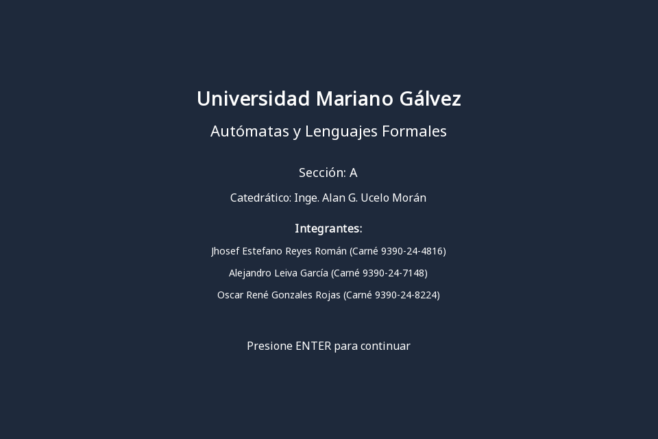
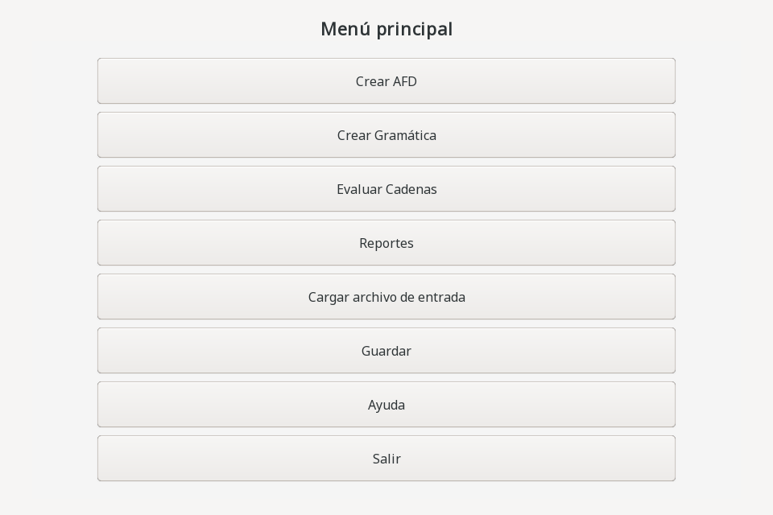
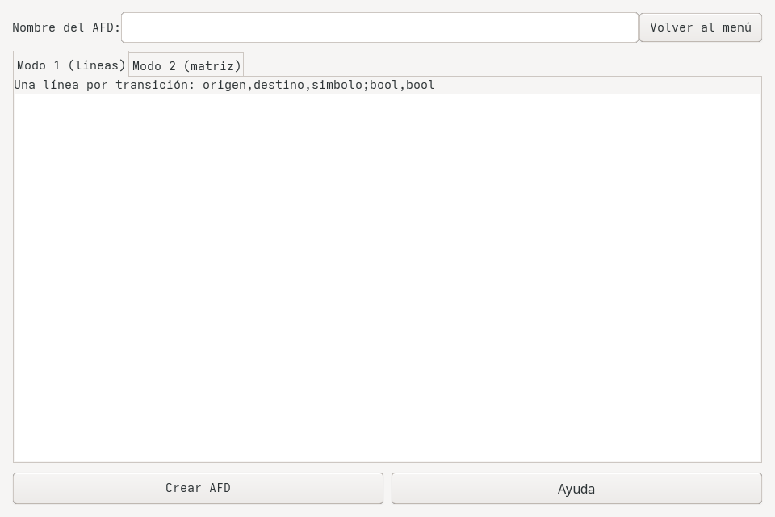
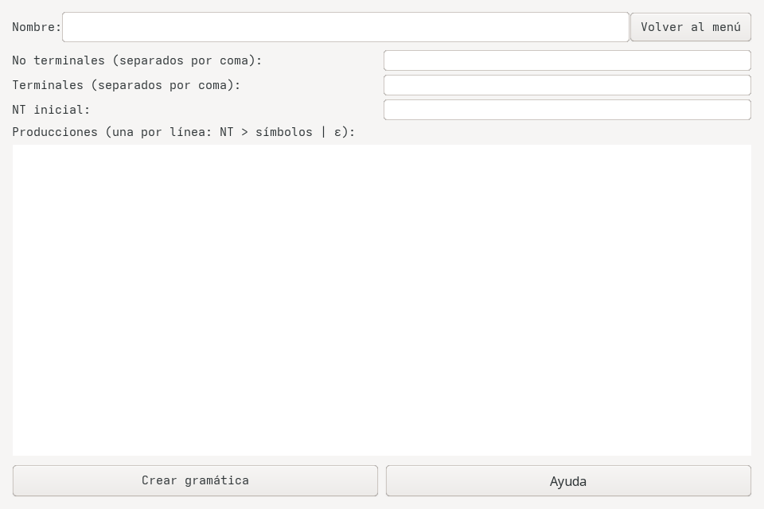
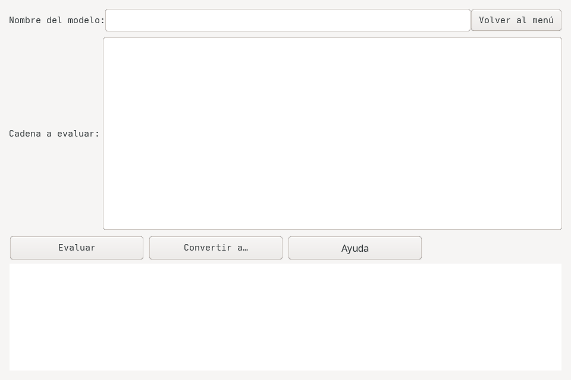
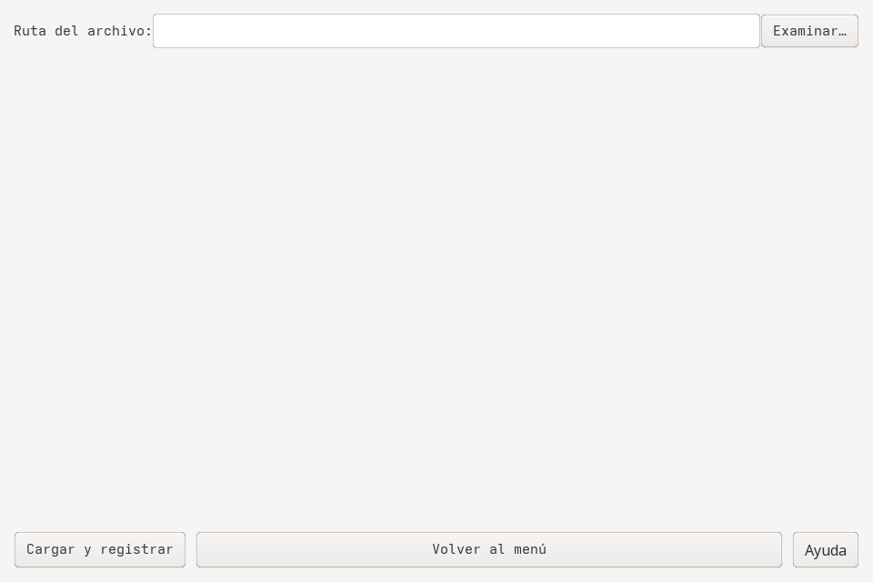
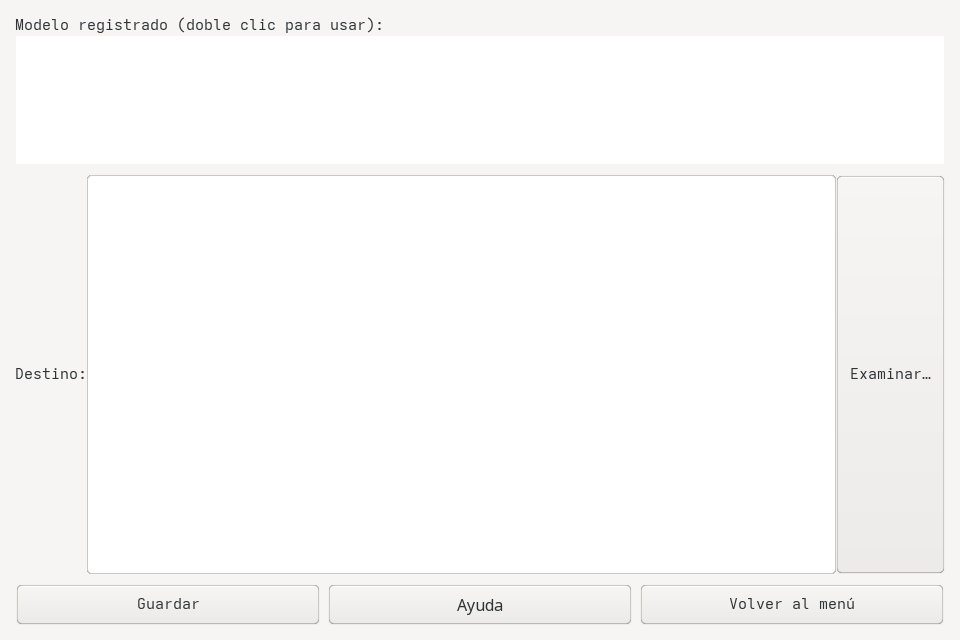
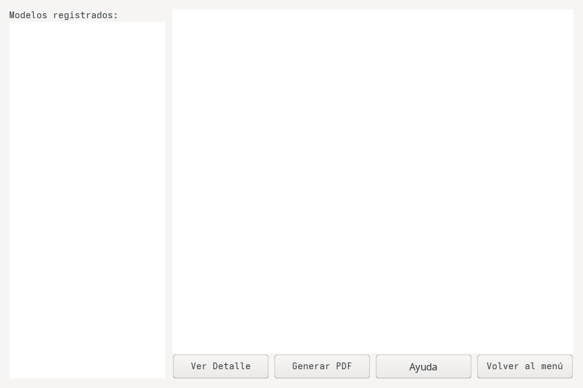

# Manual de Usuario — Proyecto Autómatas y Lenguajes Formales

> **Aplicación de escritorio** en Java Swing para la creación, evaluación y conversión
> de Autómatas Finitos Deterministas (AFD) y Gramáticas Regulares.
> Universidad Mariano Gálvez · Facultad de Ingeniería · Sección A · 2026.

| | |
|---|---|
| **Versión** | 1.1 (release v1.0.1) |
| **Stack** | Java 17 · Swing · OpenPDF · JUnit 5 |
| **Curso** | Autómatas y Lenguajes Formales |
| **Catedrático** | Inge. Alan G. Ucelo Morán |
| **Equipo** | Jhosef Reyes · Alejandro Leiva · Oscar González |

---

## 📑 Tabla de contenidos

1. [Descripción general](#1-descripción-general)
2. [Requisitos e instalación](#2-requisitos-e-instalación)
3. [Pantalla principal — Portada](#3-pantalla-principal--portada)
4. [Menú principal](#4-menú-principal)
5. [Crear AFD](#5-crear-afd)
   - [5.1 Modo 1 — línea por línea](#51-modo-1--línea-por-línea)
   - [5.2 Modo 2 — matriz](#52-modo-2--matriz)
6. [Crear Gramática](#6-crear-gramática)
7. [Evaluar Cadenas](#7-evaluar-cadenas)
8. [Cargar archivos `.afd` y `.gtk`](#8-cargar-archivos-afd-y-gtk)
9. [Guardar AFD / gramática](#9-guardar-afd--gramática)
10. [Reportes — Ver Detalle y Generar PDF](#10-reportes--ver-detalle-y-generar-pdf)
11. [Ayuda (en cada pantalla)](#11-ayuda-en-cada-pantalla)
12. [Solución de problemas](#12-solución-de-problemas)

---

## 1. Descripción general

La aplicación permite trabajar con **AFDs** y **Gramáticas Regulares** desde una interfaz
gráfica unificada. Es posible:

- ✏️ **Crear** AFDs (estados, alfabeto, inicial, aceptación, transiciones) y Gramáticas Regulares (NT, terminales, producciones).
- 🔍 **Evaluar** cadenas sobre cualquier modelo registrado, mostrando la **ruta** (AFD) o la **expansión** (gramática).
- 🔄 **Convertir** entre AFD y gramática (submenú **Convertir a…** en la pantalla de Evaluación).
- 📂 **Cargar / guardar** archivos `.afd` y `.gtk`.
- 📄 **Generar reportes PDF** con detalle, grafo (Graphviz) y ejemplos de cadenas válidas/inválidas.
- 💾 Llevar un **historial** de las cadenas evaluadas durante la sesión.

Toda la navegación se hace con teclado y ratón. La aplicación no necesita Internet para funcionar.

---

## 2. Requisitos e instalación

### 🪟 Software base

| Software | Versión mín. | Verificar |
|----------|--------------|-----------|
| ☕ **JDK 17** (Temurin / OpenJDK) | 17.0.20+ | `java -version` |
| 🟦 **Apache NetBeans** *(opcional, recomendado)* | 17+ | abrir y compilar desde el IDE |
| 🕸️ **Graphviz** *(opcional para reportes con grafo)* | 14+ | `dot -V` |
| 📄 **OpenPDF 1.3.43** *(incluida en `lib/`)* | 1.3.43 | no requiere instalación |
| 🧪 **JUnit 5.10** *(incluida en `lib/`)* | 5.10 | no requiere instalación |

### 🐧 Instalación en Fedora / Ubuntu

```bash
sudo dnf install java-17-openjdk-devel graphviz       # Fedora
sudo apt install openjdk-17-jdk graphviz              # Ubuntu/Debian
```

### 🪟 Instalación en Windows

1. Instalar **JDK 17** desde <https://adoptium.net/temurin/releases/?version=17> con el `.msi`.
2. Instalar **NetBeans** desde <https://netbeans.apache.org/download/index.html>.
3. Instalar **Graphviz** desde <https://graphviz.org/download/#windows> y **agregar `C:\Program Files\Graphviz\bin` al PATH** del sistema.
4. *(Opcional)* Definir `JAVA_HOME` apuntando al JDK.

### 🚀 Compilar y ejecutar desde línea de comandos

```bash
git clone https://github.com/jhosef-re/automatas_proyecto_umg.git
cd automatas_proyecto_umg
./probar.sh run              # abre la app Swing
./probar.sh test              # corre 203 tests
./probar.sh test run --demo   # imprime los 2 ejemplos del enunciado por consola
```

### 🪟 Compilar y ejecutar desde NetBeans

```
File → Open Project → seleccionar la carpeta del repo
Click derecho sobre el proyecto → Run (F6)
```

---

## 3. Pantalla principal — Portada

Al abrir la aplicación se muestra la **portada** con los datos del curso y los integrantes del equipo:



- **Curso:** *Autómatas y Lenguajes Formales*
- **Sección:** *A*
- **Catedrático:** *Inge. Alan G. Ucelo Morán*
- **Integrantes:**
  - Jhosef Estefano Reyes Román (Carné 9390-24-4816)
  - Alejandro Leiva García (Carné 9390-24-7148)
  - Oscar René Gonzales Rojas (Carné 9390-24-8224)

Presionar **ENTER** (o esperar unos instantes) para acceder al menú principal.

---

## 4. Menú principal



El menú tiene **8 opciones**:

| Botón | Acción |
|-------|--------|
| **Crear AFD** | Abre el panel para definir un AFD. |
| **Crear Gramática** | Abre el panel para definir una gramática regular. |
| **Evaluar Cadenas** | Evalúa una cadena contra un modelo registrado. |
| **Reportes** | Ver detalle o generar PDF de un modelo. |
| **Cargar archivo de entrada** | Lee un archivo `.afd` o `.gtk`. |
| **Guardar** | Guarda un AFD o gramática a un archivo. |
| **Ayuda** | Muestra los datos del curso. |
| **Salir** | Cierra la aplicación. |

> 💡 Los botones **Ayuda** están disponibles también dentro de cada panel individual.

---

## 5. Crear AFD



1. **Nombre del AFD:** ingresar un nombre único (no debe existir otro AFD o gramática con el mismo nombre en el `repositorio`).
2. Elegir entre **Modo 1** (línea por línea) o **Modo 2** (matriz).
3. Completar la zona de texto con las transiciones.
4. Presionar **Crear AFD**.
5. Si hay errores de validación, la aplicación mostrará un mensaje emergente con el motivo.

### 5.1 Modo 1 — línea por línea

Cada línea es una transición con el formato:

```
origen,destino,simbolo;acepta_origen,acepta_destino
```

donde `acepta_origen` y `acepta_destino` son `true` o `false`.

**Ejemplo** (AFD del enunciado):

```
A,A,a;false,false
A,C,b;false,false
B,A,a;false,false
B,C,b;false,false
C,B,a;false,false
C,D,b;false,true
```

Esto define un AFD con 4 estados (A, B, C, D), alfabeto `{a, b}`, estado inicial A
(por convención: origen de la primera transición) y aceptación **D**.

### 5.2 Modo 2 — matriz

Se compone de **3 tipos de filas** que se ingresan en orden:

```
[terminal1, terminal2, ...]                  ← alfabeto
[estado1, estado2, ...; acept1, acept2, ...] ← estados + aceptación
[dest1_a, dest1_b, ...]                     ← destinos (uno por estado)
[dest2_a, dest2_b, ...]
...
```

- Los corchetes son opcionales.
- El **`;`** separa estados de aceptación.
- La celda **`-`** indica "sin transición".
- El **estado inicial** es el primero declarado en la línea 2.

**Ejemplo** (mismo AFD del enunciado):

```
[a, b]
[A, B, C, D; D]
[A, C]
[B, C]
[B, D]
[D, -]
```

### ❌ Errores frecuentes

- **"El estado 'X' ya existe"** — no se permiten estados duplicados.
- **"Dos transiciones con el símbolo 'a' desde 'X'..."** — no se permite no-determinismo.
- **"epsilon no es válido en un AFD"** — los AFDs no permiten transiciones con ε.
- **"El símbolo 'X' es igual a un estado"** — los nombres de estados y símbolos no pueden colisionar.

---

## 6. Crear Gramática



1. **Nombre de la gramática:** único en el repositorio.
2. Completar:
   - **No terminales** (uno por línea, o separados por comas/espacios).
   - **Terminales** (uno por línea).
   - **NT inicial** (debe existir en la lista de NTs).
   - **Producciones** (ver formato abajo).
3. Presionar **Crear Gramática**.

### Formato de producciones

```
NT > simbolo1 simbolo2 ... [NT]   # una producción por línea
NT > epsilon                        # producción vacía
NT > a | b | c                      # disyunción con | (varias alternativas en una línea)
NT > a b                            # producción multi-terminal derecha-lineal
```

- **Mayúsculas = no terminales**, **minúsculas = terminales**.
- El lado derecho debe respetar la **linealidad por la derecha**:
  - solo terminales, o
  - secuencia de terminales seguida de **exactamente un** NT al final, o
  - `epsilon` (palabra reservada para vacío).

**Ejemplo** (gramática del enunciado):

```
A > 0 B
A > 1 A
A > epsilon
B > 0 B
B > 1 A
```

Esta gramática genera el lenguaje `(0|1)*23-1*` evaluando sobre `0011` produce
`A>0B>00B>001A>0011A>0011(epsilon)>0011`.

### ❌ Errores frecuentes

- **"El no terminal 'X' es igual a un terminal"** — NTs y terminales deben tener nombres distintos.
- **"La producción '...' no es lineal por la derecha"** — los NTs intermedios o múltiples NTs no están permitidos.
- **"Alternativa vacía; use 'epsilon'"** — para la palabra vacía usar `epsilon`, no dejar la alternativa en blanco.

---

## 7. Evaluar Cadenas



1. **Nombre del modelo:** nombre del AFD o gramática (búsqueda unificada en el repositorio).
2. **Cadena a evaluar:** texto a evaluar (un carácter por símbolo; la cadena vacía es válida).
3. Presionar **Evaluar**.
4. La zona de resultado muestra:
   - Para AFD: `Ruta en AFD: A, A, a; A, C, b; ...` y el veredicto (`cadena válida` o `cadena inválida`).
   - Para gramática: `Expansión Gramática: A>0B>...` con la derivación paso a paso y el veredicto.

### Convertir un modelo a otro

El botón **Convertir a…** convierte el modelo cargado:

- AFD → Gramática regular.
- Gramática → AFD equivalente.

El nuevo modelo se registra en el repositorio con un nombre sugerido (`g_<nombre>` o `afd_<nombre>`).

---

## 8. Cargar archivos `.afd` y `.gtk`



1. Presionar **Cargar archivo de entrada** desde el menú.
2. Elegir el archivo `.afd` o `.gtk` desde el selector.
3. La aplicación detecta la extensión y usa el lector apropiado (`ArchivoFactory`).
4. El modelo queda registrado en el repositorio con el nombre del archivo (sin extensión).

### Formato `.afd`

```
origen,destino,simbolo;true/false,true/false    ← una transición por línea
```

- El **estado inicial** es el origen de la primera transición.
- La **última definición** de aceptación gana.

### Formato `.gtk`

```
NT > simbolo1 simbolo2 ...   ← una producción por línea
NT > epsilon                 ← palabra reservada para vacío
```

- **Mayúsculas = NT, minúsculas = terminales.**
- El **NT inicial** es el NT de la primera línea.

Las líneas que comienzan con `#` se ignoran (comentarios).

---

## 9. Guardar AFD / Gramática



1. Desde el menú, elegir **Guardar**.
2. Seleccionar el modelo en la lista.
3. Elegir la ruta destino (`.afd` para AFD, `.gtk` para gramática).
4. Confirmar.

El archivo se escribe con el formato del enunciado y se puede volver a cargar más tarde con `Cargar archivo de entrada`.

---

## 10. Reportes — Ver Detalle y Generar PDF



### Ver Detalle

Muestra el detalle textual del modelo seleccionado:

- **AFD:** nombre, estados, alfabeto, estado inicial, estados de aceptación, transiciones.
- **Gramática:** nombre, no terminales, terminales, NT inicial, producciones.

### Generar PDF

1. Seleccionar el modelo en la lista.
2. Presionar **Generar PDF**.
3. Elegir la ruta destino (se sugiere el directorio actual).
4. La aplicación genera el PDF con:
   - **Portada** con datos del curso.
   - **Detalle** del modelo.
   - **Grafo** generado con Graphviz (si está disponible; si no, fallback con DOT en texto monoespaciado).
   - **Cadenas válidas e inválidas** generadas automáticamente (≥3 cada una, BFS por longitud).
   - **Cadenas evaluadas** durante la sesión (si las hubo).

> 🪟 Si el calificador **no tiene Graphviz** en el PATH, el PDF se sigue generando con el grafo como texto (degradación elegante). Para forzar una ruta, pasar la propiedad `-Dautomatas.graphviz.path=/ruta/a/dot` al `java`.

---

## 11. Ayuda (en cada pantalla)

Cada pantalla tiene un botón **Ayuda** que abre un diálogo modal con:

```
Curso: Autómatas y Lenguajes Formales
Sección: A
Catedrático: Inge. Alan G. Ucelo Morán
Integrantes (último dígito del carné):
  • Jhosef Estefano Reyes Román → 6
  • Alejandro Leiva García → 8
  • Oscar René Gonzales Rojas → 4
```

---

## 12. Solución de problemas

| Problema | Solución |
|----------|----------|
| **`java: command not found`** | Instalar JDK 17 y agregar al PATH. |
| **`Graphviz no se ve en el PDF`** | Instalar `graphviz` y agregar su `bin/` al PATH, o pasar `-Dautomatas.graphviz.path=/ruta/dot`. |
| **`No se reconoce la extensión .XYZ`** | Solo se aceptan `.afd` y `.gtk`. |
| **"El nombre 'X' ya existe en el repositorio"** | AFDs y gramáticas comparten espacio de nombres; usar un nombre distinto. |
| **La conversión Gramática → AFD falla con "no es lineal por la derecha"** | La gramática tiene NTs en posición intermedia o múltiples NTs; ajustar. |
| **Las cadenas largas se demoran o dan "sin derivación"** | El evaluador tiene `MAX_PROFUNDIDAD=100`. Para gramáticas recursivas usar cadenas más cortas. |
| **Tests fallan después de un cambio** | `./probar.sh clean && ./probar.sh test`. |
| **No se ven las capturas en el manual** | Las rutas son `docs/capturas/*.png`; abrir el manual desde el repo en GitHub o desde el `.zip`. |

---

> 📌 Para más detalles sobre la arquitectura, patrones de diseño y formato interno, ver **[`MANUAL_TECNICO.md`](MANUAL_TECNICO.md)**.